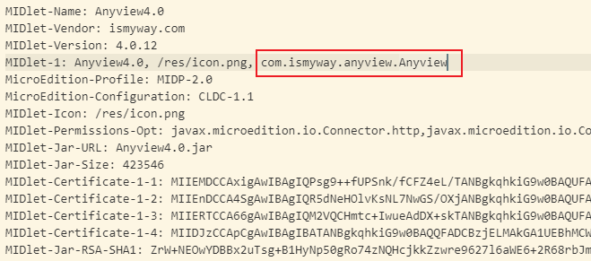

# pluotsorbet-kaios-template
PluotSorbet Java Simulator for KaiOS Template

## How to test your JAR

### Step 1

Put the JAR and JAD files you need to test into the `application/jar/` folder.

**Note: For J2ME platform applications, JAR and JAD files must exist at the same time.**

**If you don’t have a JAD file, you can open the JAR with compression software such as 7-Zip, find `META-INF/MANIFEST.MF`, extract it and rename it to `<JAR file name>.jad`**

**Then use your favorite code editor to modify it and add the following two lines, please modify according to the actual situation:**

```
MIDlet-Jar-URL: <JAR file name>.jar
MIDlet-Jar-Size: <JAR file size (Unit is bytes)>
```

**Or use third-party tools to achieve (e.g. ezJar)**

### Step 2

Modify `application/config/runtests.js`, and modify the corresponding value:

```js
config.jars = "jar/<JAR file name>.jar"; //Your jar file name
config.jad = "jar/<JAD file name>.jad";  //Your jad file name, generally the same as the JAR file name
config.midletClassName = "com.example";  //JAR's MIDlet class name, Can be found in "MIDlet-1" in the JAD file. There is a screenshot below.
```

MIDlet class name: 

### Step 3

Use WebIDE to open `application` folder, and run it!

## Known issues

1. (ALL) Sound is not supported, it is a known bug at present, we will try to fix it in the future.

2. (For some games) Occasionally there is a problem that the archive cannot be saved, which is a known bug
3. (ALL) The game may not be able to exit. A black screen will be displayed when exiting. You need to press the hang button to exit. This problem has been fixed, and some software may not be modified in time.

4. (For some games) Some game direction keys cannot use numeric keys.

5. (ALL) Because it is a J2ME VM simulated by js, the running speed may be too slow, this may be optimized by AOT technology in the future.

6. (ALL) If an error is prompted during operation, you need to press the hang button to restart the software. This is a known problem and may be fixed in the future.

7. (ALL) When you use the `*` and `#` keys to take a screenshot, it may trigger a reload of the game and cause a flashing screen. This is a function introduced during debugging and may be fixed in the future.

## License

LGPL-2.1